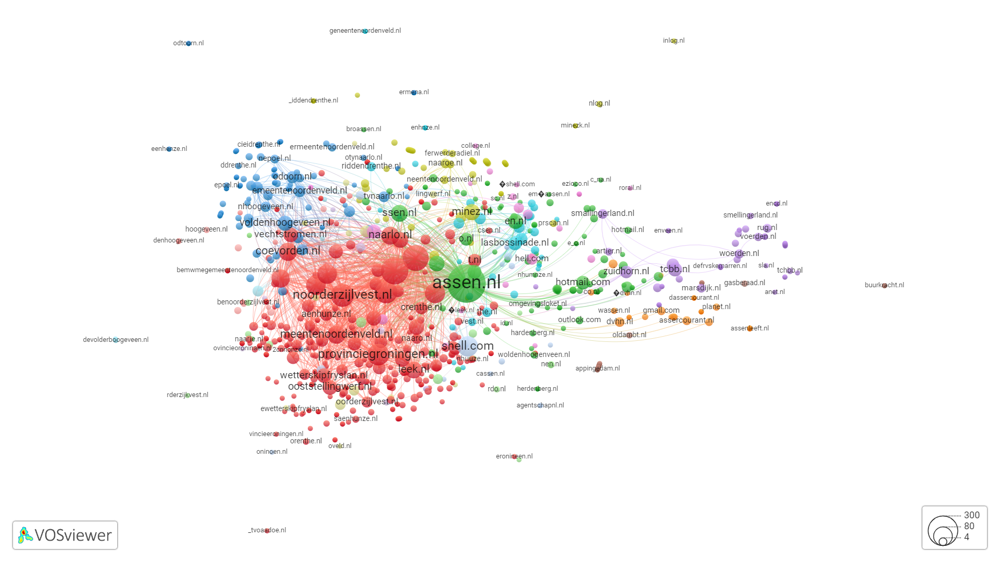
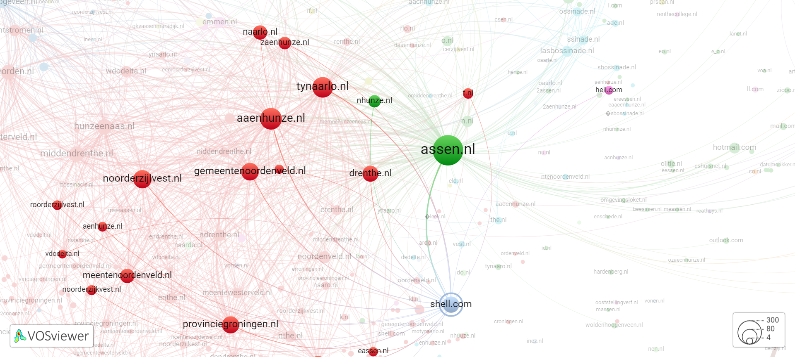

# Network analysis of email sender and recipient domains in the Shell papers

## Proposed idea

Make a network visualization of email sender and recipient domains in the Shell papers using [VOSViewer](https://www.vosviewer.com/). This could be an alternative way to identify clusters within the email correspondence, complementing a keyword-based clustering approach. 

## Data
The raw data is available on the [FTM repository](https://github.com/ftmnl/asr)

The script used for the basic-pre-processing can be found in the 
[asreview-ftm-hackathon/Example-for-data-pre-processing-track](https://github.com/asreview-ftm-hackathon/Example-for-data-pre-processing-track)
repository, and the pre-processed data is copied from this repository.

The copied pre-processed data can be found in the `data` folder, named `preprocessed_data.xlsx`.

## Processing data for visualization

Data are processed for visualization using the script in the R Markdown notebook `visualization_processing.Rmd` in the folder `scripts`.  
Required R packages are:  `jsonlite`, `readxl`, `tidytext` and `tidyverse`, which can be installed using the function `install.packages("package-name")`.

Preprocessing is done as follows:

*Identifying email domains*

1. Filter all records of type "Mail"
2. Split the record content (column Abstract) into individual lines (using tokenization)
3. Filter on lines likely containing email addresses (i.e. containing @ and/or "to:" / "from:" / "aan:" / "van:")
4. Split lines into words (using tokenization). NB This automatically gets rid of email prefixes by removing "@"
5. Filter on strings containing one period (.) to identify likely email domains
6. Filter on actual email domains by matching to the [IANA list op top-level domains](https://data.iana.org/TLD/tlds-alpha-by-domain.txt)

*Formatting for visualization*

For visualization in VOSViewer, a JSON object is created according to these specifications: [https://app.vosviewer.com/docs/file-types/json-file-type/](https://app.vosviewer.com/docs/file-types/json-file-type/):

1. Create node list of all domains, with number of records the domain occurs in as 'weight'
2. Create edge list for all combinations of domains that occur together in a record at least once, with the number of records the combination occurs in as 'strength'.
3. Create a nested list with node list and edge list and store as JSON object

The resulting JSON object can be found in the `output` folder, named `network_domains.json`.

## Network visualization

For visualization, [VOSViewer Online](https://app.vosviewer.com/) is used, which is a web-based version of [VOSviewer](https://www.vosviewer.com/). It runs in a web browser and can be used to create and share interactive visualizations and to embed these visualizations in online platforms. VOSViewer Online is open source ([https://github.com/neesjanvaneck/VOSviewer-Online](https://github.com/neesjanvaneck/VOSviewer-Online)), and is developed by Ludo Waltman and Nees Jan van Eck at CWTS (Netherlands). 

After importing the created JSON object with network information into VOSViewer online, various settings for layout and clustering can be experimented with. The online visualization allows zooming in and out and selecting single nodes to highlight their connections.

The resulting network visualization can be exported as JSON object again (including all information for layout and clustering) and as static image. Both are stored in the folder `output` as  `VOSviewer-network_linlog_3_1.json` and `VOSviewer-screenshot_linlog_3_1.png`, respectively.    

For the network visualization shown here (overview and detail image), the following settings were used:
(all other settings, including advanced settings, were used as default)

- **Scale**: 0.7
- **Normalization method**: LinLog/modularity
- **Layout**: Attraction: 3, Repulsion: 1
- **Clustering**: Resolution: 10, Minimum cluster size: 10, Merge small clusters: yes 

## Result 

**Nodes** represent email domains, with **node size** relative to the number of records the domain appears in. **Edges** link email domains present in the same document(s), either as sender/receiver or as multiple receivers. 

**Clusters** (distinguished by colour) are determined algorithmically by the application, representing email domains that are more closely connected to each other than to other email domains.

A note on information density: the network is quite dense due to the decision to include all datapoints. However, since the online version allows drilling down into individual datapoints or clusters, it can be considered to support **exploration of the data** over an **initial overview of main trends**. 

## Ideas for future improvement
- further clean email domains (harmonize OCR errors) 
- distinguish From/To email addresses to create directional network (but: issue with data quality)
- separate out email threads (Replies/Forwards)
- use date information to create time lapse visualization

Another group in this hackathon also looked at email exchanges over time, with some additional considerations re: data preprocessing:
https://github.com/asreview-ftm-hackathon/data-preprocessing_toogoodtogo_threatlines

## Applicability to larger dataset 
In principle, the method can be directly applied to a larger dataset (when preprocessing is done similar to the sample dataset). For a clear visualization, a cut-off value for which domains to include can be used (e..g based on node weight and/or link strength).  
